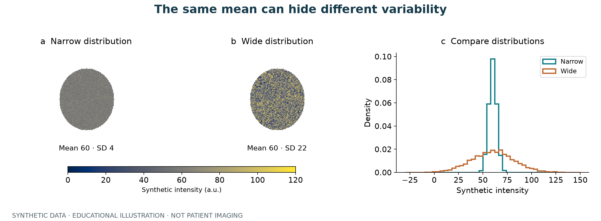

# A few basic concepts

Imagine a tumor as a landscape with different textures. Two landscapes can have the same average elevation while one is flat and the other is uneven. The same high and low areas can also form large patches or scattered fragments.

CT heterogeneity analysis describes differences like these. It measures **image appearance**, rather than directly revealing histology.

## Images, voxels, and masks

| Term | Plain-language meaning | In code |
| --- | --- | --- |
| CT image | A three-dimensional intensity map | `image[z, y, x]` |
| Voxel | One small cell in a 3D image | One array value |
| Mask | A map of cells that belong to the tumor | Foreground is `True` or positive |
| ROI | The region being analyzed | `image[mask > 0]` |
| Spacing | Physical cell dimensions in mm | For example, `(1, 1, 1)` |
| Feature | A number describing one aspect of the image | Mean, standard deviation, fractal fit |
| Label map | A map assigning numbers to image regions | 0 is background; positive integers identify regions |

Matching array shapes only means that the cell counts match. Also check spacing, origin, direction, and anatomical registration.

## Why not just use the mean?

Consider two simplified ROIs:

| ROI | Values | Mean | Appearance |
| --- | --- | --- | --- |
| A | 50, 50, 50, 50 | 50 | Uniform intensity |
| B | 20, 40, 60, 80 | 50 | More variable intensity |

The mean cannot distinguish them; the standard deviation can. But rearranging B's cells changes its spatial pattern without changing its histogram. That is why we examine both **value distributions** and **regional organization**.

This is a conceptual example, not a DHI test input. The actual DHI calculation also applies steps such as percentile trimming.

## Scores, features, and maps

- **score:** a model's selected summary measure, useful for an initial comparison.
- **features:** the measurements behind the summary, such as intensity variation or mixing.
- **label_map:** where the regions are, useful for spatial inspection.
- **details:** calculation notes, such as voxel counts, block counts, or fit diagnostics.

Think of these as a summary, an itemized description, a map, and calculation notes. A low score does not automatically mean low risk; a region number is not a pathology label.

## A reproducible starting point

Run DHI on synthetic data first. Then inspect a few real cases and their spatial alignment. Finally, fix the parameters and process the cohort. Continue to [Getting Started](getting-started.md).

## See the difference

Synthetic data with a shared color scale show why the mean cannot describe all intensity variation. See the [visual guide](visual-guide.md) for explanations and spatial comparisons.
