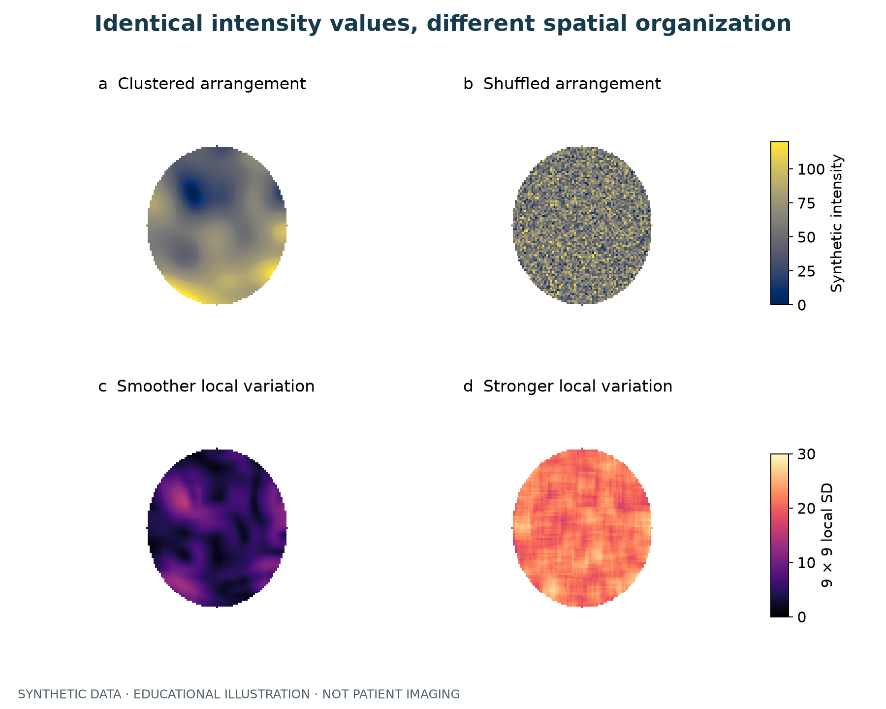
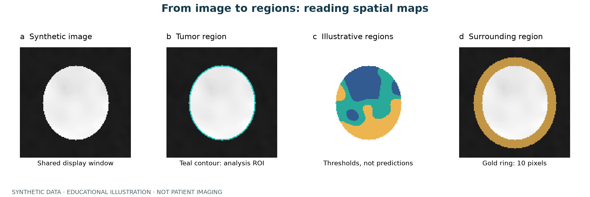

# Visual guide to heterogeneity

Start with the pictures, then interpret the numbers. Three reproducible synthetic examples explain intensity distributions, spatial arrangement, and regions of analysis.

**All images are educational simulations, with no patient imaging. Colors do not indicate pathology, malignancy, or clinical risk. These are not outputs of the package's models.**

## 1. Equal means can conceal different variability


Both images use the same elliptical mask and color scale. Their mean is 60, but the second image has greater intensity variation, visible as a wider histogram. Standard deviation is calculated across all masked pixels with `ddof=0`. Intensities are arbitrary units, not CT Hounsfield units.

This illustrates why **DHI considers intensity variation**, but the displayed standard deviation is not a DHI score. See [Design principles](design-principles.md) for the actual definition and limitations when mean intensity approaches zero.

## 2. Equal histograms can conceal different spatial structures



The top images contain **exactly the same pixel values**. Their means, standard deviations, and histograms are identical; only pixel locations differ. The first forms contiguous regions, while the second is finely mixed.

The bottom row shows a simple local variation measure: the standard deviation of **masked pixels in each 9 × 9 neighborhood**. Pixels outside the mask are excluded; edge neighborhoods contain fewer valid pixels. Each row uses a common color scale for comparison.

Histograms alone cannot describe these spatial differences, motivating neighborhood and partition-based analysis. This local SD map is an educational measure, **not an output of THI, HAB, or ITH-FS**. See [Models and outputs](models.md) for their use of spatial information.

## 3. Images, masks, partitions, and surrounding tissue



- The **synthetic image** supplies intensities. Image panels share a display range of −800 to 120 for illustration only.
- The **mask** defines where measurements are made; the teal outline marks this example's analysis region.
- The **partition map** shows how regions are arranged. Here, thresholds of 50 and 70 split synthetic intensities into three classes to illustrate discrete labels. Colors are class identifiers, not risk levels. No HAB GMM or THI clustering algorithm was used.
- The **surrounding ring** represents tissue outside the boundary. Its width is 10 pixels here; real PTH analysis must use physical distances with voxel spacing and the model's input conventions.

This is a 2D illustration, not a 3D CT reconstruction or pathology map. Interpret real spatial maps alongside the original image, segmentation quality, voxel spacing, and parameter settings.

## Reproduce and download

Download the [Python plotting script](../_static/figures/generate_figures.py) and [numeric summary CSV](../_static/figures/summary.csv). The script fixes the random seed at `42` and generates only synthetic arrays; it does not require the private implementation.

```bash
python -m pip install numpy scipy matplotlib
python generate_figures.py
```

Chinese figures use Microsoft YaHei. On systems without that font, replace its name in the script with an installed Chinese font. The script exports Chinese and English PNG files and SVG files with editable text to its own directory.

Vector downloads: [Intensity distributions](../_static/figures/intensity-en.svg) · [Spatial arrangement](../_static/figures/spatial-en.svg) · [Analysis regions](../_static/figures/workflow-en.svg).

These examples explain concepts; they do not represent patient sample sizes, inferential statistical tests, or clinical validation.
