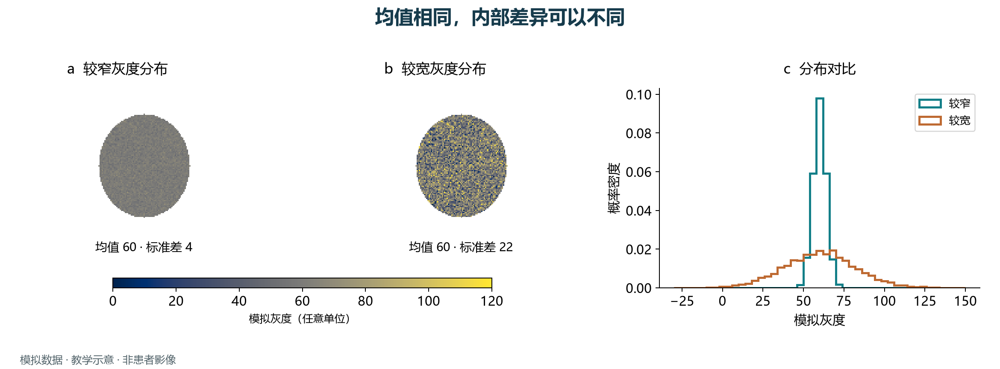
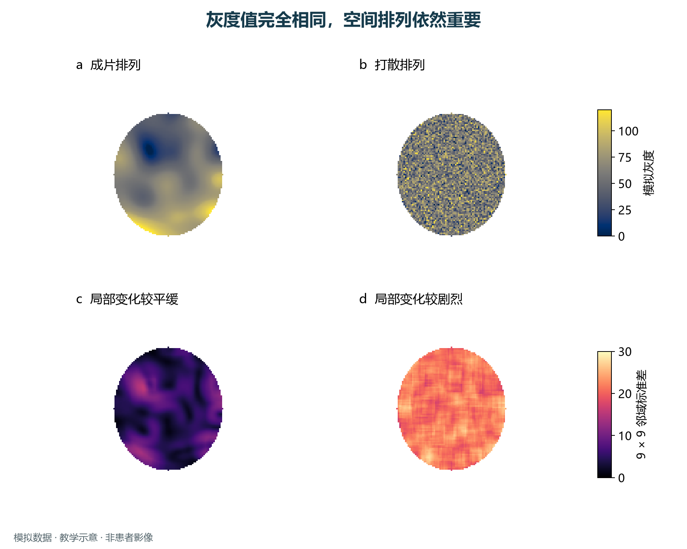
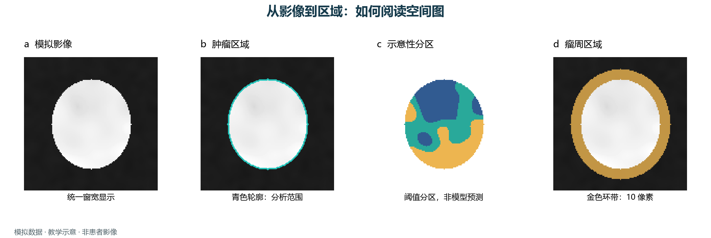

# 异质性可视化图解

先看图，再理解数值。这里用三组可复现的模拟数据，解释灰度分布、空间排列和分析区域分别告诉我们什么。

**所有图片均为教学模拟，不含患者影像。彩色区域不代表病理类型、恶性程度或临床风险；它们也不是本包模型运行结果。**

## 1. 平均值相同，变化幅度可以不同



两幅图使用相同的椭圆掩膜和相同色标，平均灰度都是 60，但右侧区域的灰度变化更大。直方图把这种差别表现为“更宽的分布”。图中的标准差使用掩膜内所有像素、`ddof=0`；灰度为任意单位，不是 CT 的 HU。

这帮助理解 **DHI 关注灰度变异** 的出发点，但图中标准差不等于 DHI 分数。DHI 的完整定义及灰度均值接近零时的限制见 [设计原理](design-principles.md)。

## 2. 直方图相同，也可能有不同的空间结构



上排两幅图包含**完全相同的一组像素值**：均值、标准差和直方图完全相同，只改变像素的位置。左侧形成连续片区，右侧呈现细碎混合。

下排显示一个简单的局部变化指标：每个像素周围 **9 × 9 邻域中、属于肿瘤掩膜的像素的标准差**。掩膜外不参与计算；边缘邻域有效像素较少。上下两排分别使用共同色标，便于比较。

这说明为什么分析不能只看直方图，也需要考虑邻域和分区。这里的局部标准差图是教学指标，**不是 THI、HAB 或 ITH-FS 的输出**。这些模型如何利用空间信息，见 [模型与输出](models.md)。

## 3. 影像、掩膜、分区和瘤周环带



- **模拟影像**提供灰度；各影像面板使用相同显示范围 −800 至 120，仅用于示意。
- **掩膜**回答“在哪里计算”：青色轮廓表示本例的分析区域。
- **分区图**回答“区域如何分布”：这里直接按模拟灰度 50、70 分成三类，展示离散标签图的读法；颜色只是类别编号，没有高低风险含义，也没有使用 HAB 的 GMM 或 THI 的聚类算法。
- **瘤周环带**展示边界外的邻近组织。本例宽度是 10 像素；真实 PTH 分析应根据体素间距使用物理距离，并遵守相应模型的输入约定。

这是二维示意，不是三维 CT 重建或病理分区。阅读真实空间图时，还需同时查看原影像、分割质量、体素间距与参数设置。

## 复现与下载

下载 [Python 绘图脚本](_static/figures/generate_figures.py) 和 [数值摘要 CSV](_static/figures/summary.csv)。脚本固定随机种子为 `42`，仅生成模拟数组，不依赖私有实现代码。

```bash
python -m pip install numpy scipy matplotlib
python generate_figures.py
```

中文图使用 Microsoft YaHei 字体；在没有该字体的系统上，请将脚本中的字体名替换为已安装的中文字体。脚本输出中英文 PNG 和可编辑文字的 SVG；输出写在脚本所在目录。

矢量图下载：[灰度分布](_static/figures/intensity-zh.svg) · [空间排列](_static/figures/spatial-zh.svg) · [分析区域](_static/figures/workflow-zh.svg)。

这些图用于概念解释，没有患者样本量、组间统计检验或临床验证结论。
